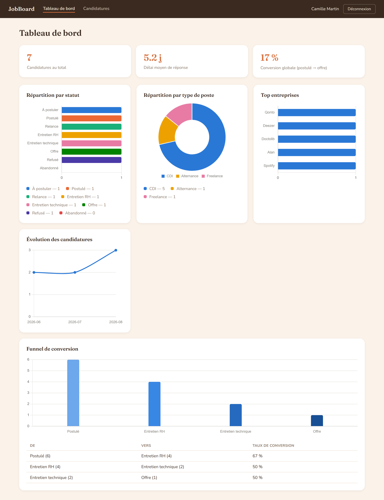
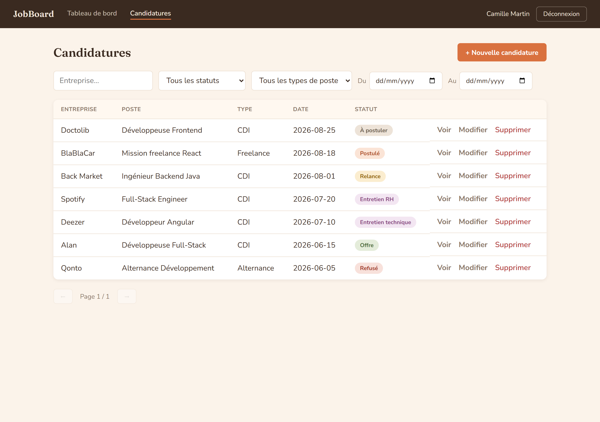
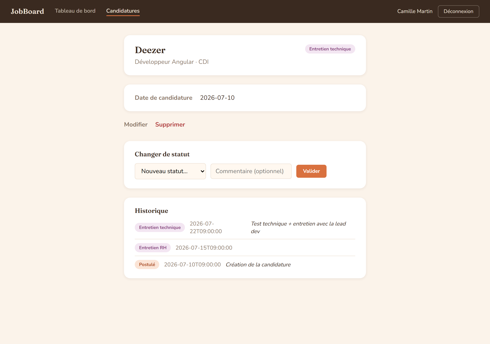
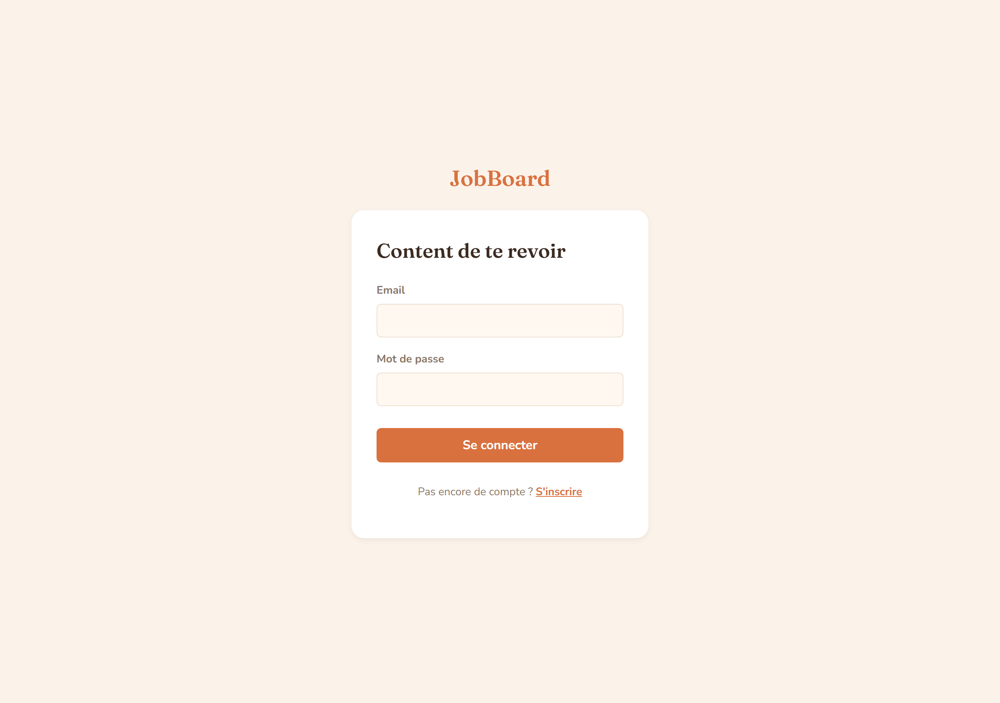

# JobBoard


Application de suivi de candidatures : centraliser ses candidatures, leur avancement
(entretiens, relances, réponses) et visualiser sa recherche d'emploi sous forme de
statistiques plutôt que dans un tableur.

Ce projet sert un double objectif : un outil que j'utilise réellement pour ma
propre recherche, et un projet de portfolio pour démontrer une maîtrise
bout-en-bout d'Angular et Spring Boot — architecture en couches côté backend,
authentification JWT, agrégations SQL, un dashboard de data-visualisation avec une
palette validée pour l'accessibilité.



<details>
<summary>Autres captures d'écran (liste, détail, connexion)</summary>





</details>

## Fonctionnalités

- **Authentification JWT** — inscription, connexion, routes protégées (Spring
  Security côté API, guard + intercepteurs côté Angular)
- **CRUD complet des candidatures** — créer, lister, modifier, supprimer, avec
  filtres combinables (statut, type de poste, entreprise, période) et pagination
- **Historique de statut automatique** — chaque changement d'état (et la création
  elle-même) génère une ligne d'historique horodatée, avec commentaire optionnel ;
  antidatable pour saisir une candidature déjà en cours
- **Dashboard statistiques** — répartition par statut et par type de poste, top
  entreprises, évolution mensuelle, funnel de conversion entre étapes du recrutement,
  délai moyen de réponse
- **Isolation multi-utilisateurs** — chaque candidature n'est visible/modifiable
  que par son propriétaire (vérifié en base, pas seulement côté application ;
  accéder à une candidature d'un autre utilisateur renvoie 404, jamais 403, pour
  ne pas confirmer son existence)

## Stack technique

**Backend**
- Java 21, Spring Boot 4.1 (Spring Web, Spring Data JPA, Spring Security 7)
- PostgreSQL 17, migrations versionnées avec Flyway
- JWT (jjwt) pour l'authentification stateless
- MapStruct (mapping entité ↔ DTO) et Lombok
- Bean Validation, springdoc-openapi (Swagger UI en dev)
- Maven (avec wrapper `mvnw`)

**Frontend**
- Angular 22, standalone components, signals
- Angular Reactive Forms, Router (guards, lazy loading par feature)
- RxJS, Chart.js pour les graphiques du dashboard

**Infra**
- Docker Compose pour PostgreSQL en local

## Démarrage rapide

Prérequis : Docker, Java 21+, Node.js 22.22+ ou 24.15+ (requis par Angular CLI 22).

```bash
# 1. Base de données
docker compose up -d

# 2. Backend (http://localhost:8080)
cd backend
./mvnw spring-boot:run

# 3. Frontend (http://localhost:4200)
cd frontend
npm install
npm start
```

La documentation de l'API est disponible sur `http://localhost:8080/swagger-ui.html`
une fois le backend démarré.

Le profil `dev` du backend embarque des valeurs par défaut pour la base de données
et le secret JWT — largement suffisant pour tourner en local, mais **à ne jamais
utiliser tel quel en dehors du poste de développement** (voir
`backend/src/main/resources/application.yml` et `.env.example` à la racine pour les
variables à surcharger).

## Structure du projet

```
JobBoard/
├── backend/    # API Spring Boot (architecture en couches)
│   └── src/main/java/com/jobboard/
│       ├── controller/   # endpoints REST
│       ├── service/      # logique métier
│       ├── repository/   # accès aux données (Spring Data JPA + Specifications)
│       ├── entity/       # entités JPA
│       ├── dto/          # objets d'échange (records)
│       ├── mapper/       # MapStruct
│       ├── security/     # JWT, UserDetails
│       └── config/       # sécurité, CORS
├── frontend/   # SPA Angular
│   └── src/app/
│       ├── core/       # services transverses, guards, intercepteurs, modèles
│       ├── features/   # un dossier par domaine (auth, applications, dashboard)
│       └── shared/     # composants/pipes/constantes réutilisables
└── docker-compose.yml
```

## Tests

- Frontend : `cd frontend && npm test` (Vitest, tests de fumée sur chaque
  composant standalone)
- Backend : la logique a été vérifiée manuellement à chaque étape (requêtes
  `curl` couvrant les cas nominaux, les erreurs de validation et l'isolation
  multi-utilisateurs) plutôt que par une suite automatisée — une vraie couverture
  JUnit/Mockito est la prochaine étape naturelle du projet (voir ci-dessous)

## Choix assumés

Quelques compromis délibérés, posés en connaissance de cause plutôt que par oubli :

- **Token JWT unique, sans refresh token** — expiration à 24h ; suffisant pour un
  usage personnel, un flux de refresh serait l'étape naturelle pour une appli
  multi-utilisateurs réelle
- **Token stocké en `localStorage`** plutôt qu'un cookie httpOnly — plus simple à
  mettre en œuvre, au prix d'une surface d'attaque XSS légèrement plus large
- **Valeurs d'énum en anglais côté API** (`APPLIED`, `HR_INTERVIEW`…), traduites en
  français uniquement dans une couche d'affichage dédiée (labels + pipes) — l'API
  reste indépendante de la langue d'affichage
- **Pas de suite de tests automatisés côté backend** pour l'instant (voir
  section Tests)

## À venir

- Suite de tests JUnit/Mockito côté backend
- Rappels visuels si aucune nouvelle d'une candidature depuis X jours
- Gestion des contacts par candidature (recruteur, email, téléphone)

---

Projet personnel à but d'apprentissage et de portfolio.
